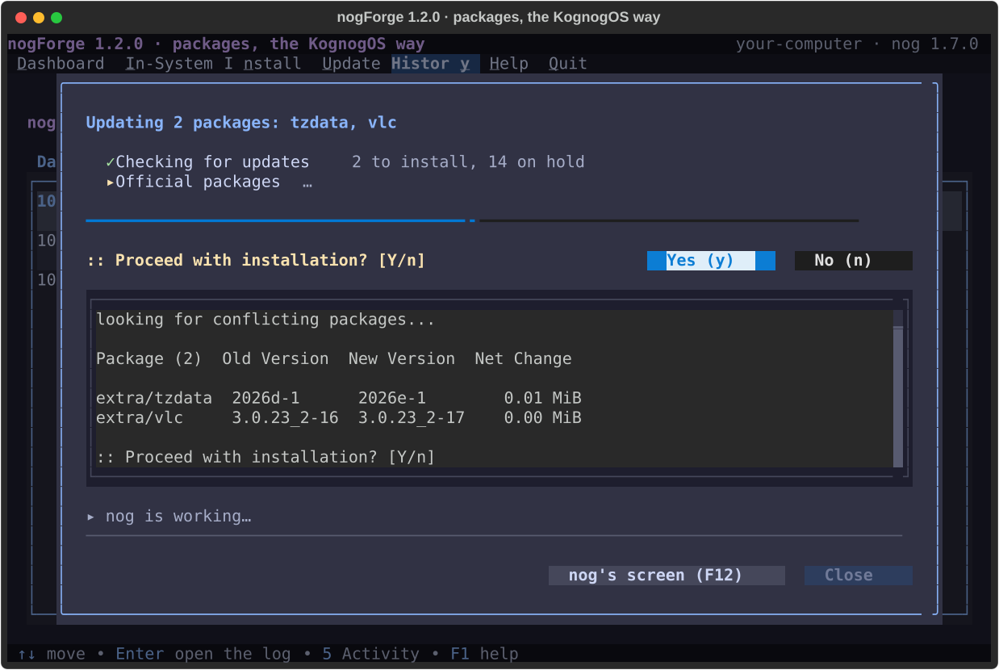
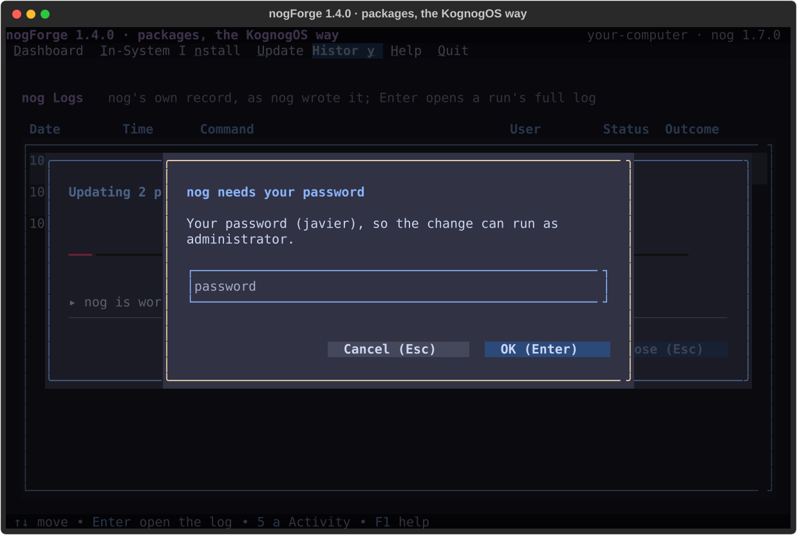

# nogForge

> Packages, the KognogOS way: what's installed, searching and installing, and updates, in plain words, in a terminal. The decisions are **nog**'s; nogForge shows them.


[](https://aur.archlinux.org/packages/nogforge)

---

## Why nogForge?

[nog](https://github.com/jetomev/nog) is KognogOS's package manager: pacman with a safety net. Every package has a **tier**, and a new version waits before it installs (30 days for the kernel and its kind, 15 for the desktop, 7 for the rest) so it can prove itself on other people's computers first.

nogForge brings what [Pamac](https://github.com/manjaro/pamac), Manjaro's software centre, does so well (with thanks: it's the inspiration) to the terminal, on top of nog: your programs as a table, a search with types, and updates you can read. **nog decides; nogForge shows it.** Tiers, holds and which packages must move together are never worked out twice.

---

## What's in 1.4

From Javier's first run of nogForge inside **hypeForge Settings** (8 October 2026): **every name in the menu bar has a number and a Ctrl key**, the same in every Forge app. **1–6** go left to right: Dashboard, In-System, Install, Update, **History**, **Help**; History and Help now both open their menus (5 used to jump straight into one of History's pages). **Ctrl** + the underlined letter works too, even from inside a search box: Ctrl+U (Update) used to do nothing, and so did Ctrl+Y (History), now **Ctrl+S** under Javier's letter rule: each name gets the first letter of its name, or the next free letter of the name when that one is taken; Help is always H and Quit Q. A menu closes when you press its number again, and its name is lit while it's open. **License** and **About** show as pages instead of windows; Esc goes back. The bottom bar says **1-6 menu**. And nogForge **never closes while nog is working**: a half-finished update could break the system.

## What's in 1.3

Same evening, twenty minutes after 1.2.0 (Javier: *"much better… but"*): **every search follows as you type**, on In-System, Install and Update alike, and the Search button is gone (Install, which asks nog, waits half a second after your last keystroke and needs two characters). And the **filter rows are one row tall** instead of three: boxes, labels, drop-downs and buttons, so each page shows four or five more packages.

## What's in 1.1

- 🏠 **Dashboard**: updates per source and tier (nog's real plan), your packages per source and tier, the last things nog did, and the space old downloads take.
- 📦 **In-System**: what's on this computer, spreadsheet-style: badge, name, version, tier, repository, a **✕ Uninstall** button and, where nog has a newer version, **⬆ Update** beside it, with what it is underneath. System packages are **Locked**, with the reason: the system needs it to start, it's part of the base system, or another package needs it.
- 🔎 **Install**: search the repositories and the AUR (names and descriptions, best matches first) and **+ Install**.
- One **filter bar** on both: Search (the list follows as you type), Show (yours or all), Type (Games, Graphics, Office…), Tier, and **Repositories (p)**, a window to tick the repositories to show.
- ⬆ **Update**: nog's plan with your choices. Untick an update to keep it back, and **nog** says what must stay back with it, so a half-updated, broken system can't happen. A tick changes at once; while nog works out your choices, a yellow sign says so. **↑ Promote** makes a held one ready now; it goes in with the rest. **Update the Ticked Ones** hands nog exactly those, by name, and nog shows and installs only them; **⬆ Update** on a row does that one by itself, **Find** narrows the lists, **Tick All** / **Untick All** do the lot. Afterwards, **What changed** compares versions before and after, and after a new kernel offers **Restart Now (r)** or **Later (l)**.
- 🗂 **History**: **Activity** (everything nog ran, in plain words) and **nog Logs** (nog's own record; Enter opens a run whole, as it appeared on screen).
- 🪟 **nog works inside nogForge** *(1.1)*: a change opens a window over the app with nog's steps and a progress bar. nog's own screen opens by itself when nog or pacman asks something (pacman's table in view, **Yes (y) / No (n)** to answer), when something fails, or on **F12**. yay's menus for AUR builds are typed in it. Nothing leaves the app.
- 🔐 **The password is asked in nogForge's own box** *(1.1)*, on a desktop and on a text console alike. It goes to sudo and nowhere else; nothing is written to disk.
- 📖 A manual inside the app (**F1**), readable on a plain text console, nothing cut off at 100 columns.

Arch's app catalogue (the one Pamac uses) gives apps their proper names and a category badge (🎮 🎨 🎵 📝 🌐 ⚙); a terminal can't draw app icons, and on a text console the badges become two letters.

The design, drawn and approved before any code: [`docs/design/v0.1-screens.html`](docs/design/v0.1-screens.html).

---

## Screenshots

### Dashboard


### In-System


### Install, and the review before installing


### Update: one kept back, one promoted


### nog at work, inside nogForge (1.1)



### History: Activity and nog Logs


*Made from the running app (`python docs/screenshots/generate.py`) with a stand-in nog and a sample package list.*

---

## Requirements

- KognogOS or Arch Linux
- **nog 1.7.0 or newer** (nogForge reads its `--json` answers and its steps, and hands it the ticked updates by name)
- Python 3.11+, `python-textual`, `python-rich`, [`python-forgekit`](https://github.com/jetomev/forgekit) 0.10.0+ (with `python-pyte`)
- `archlinux-appstream-data` for app names and badges (optional; without it every package gets the plain badge)

## Installation

From the [AUR](https://aur.archlinux.org/packages/nogforge), with nog:

```bash
nog install nogforge
nogforge
```

Or from source:

```bash
git clone https://github.com/jetomev/nogforge.git
python3 nogforge/main.py
```

`man nogforge` has the reference; **F1** inside the app has the manual.

### Inside hypeForge Settings

hypeForge Settings shows nogForge as one of its pages. It starts nogForge with `--hypeforge` (or `--hypeForge`), an option meant for Settings, not for typing, so `--help` doesn't list it. Started that way, nogForge has **no Quit**: q and Ctrl+Q do nothing, and Settings closes it, asking nogForge first. Everything else is the same.

---

## Keys

| Key | Does |
|---|---|
| 1 – 6 | Dashboard, In-System, Install, Update, History (opens its menu), Help (opens its menu) |
| Ctrl + underlined letter | the same: Ctrl+D, Ctrl+I, Ctrl+N, Ctrl+U, Ctrl+S (History), Ctrl+H (Help); works from a search box too |
| u | open Update · on Update: update the ticked ones |
| t · n | on Update: tick all · untick all |
| / | on Update: the Find box (on In-System and Install: Search) |
| r | review packages (Install) |
| k | check for updates |
| c | clean up old downloads (asks first) |
| p | Repositories (In-System, Install) |
| Space | tick or untick an update |
| Enter | the row's option: install, remove, promote · on nog Logs: open the run |
| Del | uninstall the selected package (In-System) |
| / | search |
| F1 | help on this screen |
| ? | all keys |
| q · Ctrl+Q | quit (never while nog is working; not there inside hypeForge Settings) |

---

## Roadmap (each version tested by Javier before the next)

- [ ] **Settings** — nog's holds and sources, pacman's safe options, repositories (signatures required, key checked first), cleaning
- [ ] **Flatpak and Snap installs**, with nog's install chain (nog C3)

---

## Changelog

### v1.4.0 — October 8, 2026 · the menu's keys, the same in every Forge app ([#24](https://github.com/jetomev/nogforge/issues/24), [#25](https://github.com/jetomev/nogforge/issues/25), [#26](https://github.com/jetomev/nogforge/issues/26))

- **Ctrl + the underlined letter works everywhere** ([F-14, #24](https://github.com/jetomev/nogforge/issues/24)): Ctrl+U (Update) did nothing while the cursor was in a search box, because the box used Ctrl+U for "delete what I typed"; Ctrl+Y (History) had never been set up. Both now come from [forgekit 0.10.0](https://github.com/jetomev/forge-suite), which gives every menu entry its Ctrl key, ahead of the box. History's key became **Ctrl+S** under **Javier's letter rule**, the same in every Forge app: each name gets the first letter of its name, or the next free letter of the name when that one is taken; Help is always H and Quit Q (H is Help and I is In-System, so History gets S; Install gets N).
- **5 opens History's menu, 6 opens Help's** ([F-15, #25](https://github.com/jetomev/nogforge/issues/25)): 5 and 6 used to jump straight into History's two pages. Now the numbers go left to right along the menu bar, Help included, and the bottom bar says **1-6 menu** instead of "1-6 screens". **h** still opens Activity. From Javier's second run: **a menu's number pressed again closes it**, and **the open menu's name is lit**.
- **License and About are pages** in the main area, not windows; Help is lit while they show, and Esc goes back to the page you came from.
- **`--hypeforge`** ([#26](https://github.com/jetomev/nogforge/issues/26)): how hypeForge Settings starts nogForge as one of its pages: no Quit, and Settings closes it. Left out of `--help` on purpose.
- **Never closed while nog is working**: q, Ctrl+Q, Quit and Settings' request all wait until nog is done (before, Ctrl+Q during an update closed nogForge, and nog with it).
- Needs forgekit 0.10.0. Tests: 54 (was 42), no warnings (was none).

### v1.3.0 — October 7, 2026 · searches follow the typing; one-row filters ([#21](https://github.com/jetomev/nogforge/issues/21), [#22](https://github.com/jetomev/nogforge/issues/22))

- **Every search filters as you type**, like Update's Find: In-System at once (it filters what is already here); Install after half a second's pause and from two characters on (it asks nog); Enter still searches at once; an emptied box clears the results. The Search button is gone.
- **One-row filters:** the search boxes, labels, drop-downs and buttons on the filter rows are one row tall (they were three), on a terminal and on a text console alike. The filter area went from seven rows to four.
- Tests: 42 (was 41); the position checks cover the drop-downs' height.

*Earlier versions: [docs/CHANGELOG.md](docs/CHANGELOG.md).*

## How this project is built

A human and AI collaboration: the screens were drawn and approved before any code, every change is tested (54 tests, a stand-in nog, so no test touches your packages), and the `testing/` folder holds the test matrices, published on purpose.

## Authors

**Javier ([@jetomev](https://github.com/jetomev))**: idea, direction, testing

**Claude (Anthropic)**: co-developer, architecture, implementation

## License

GPL v3. See [LICENSE](LICENSE).
