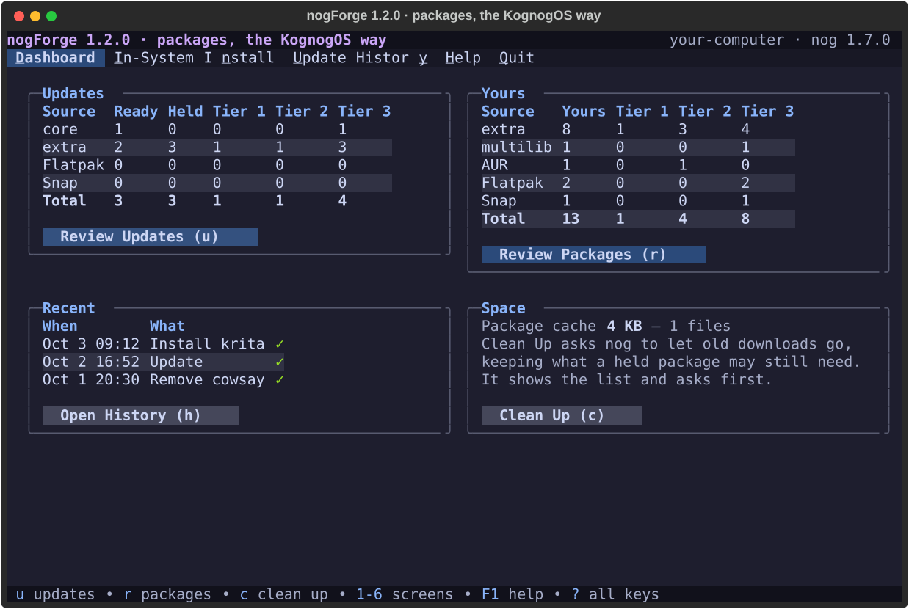
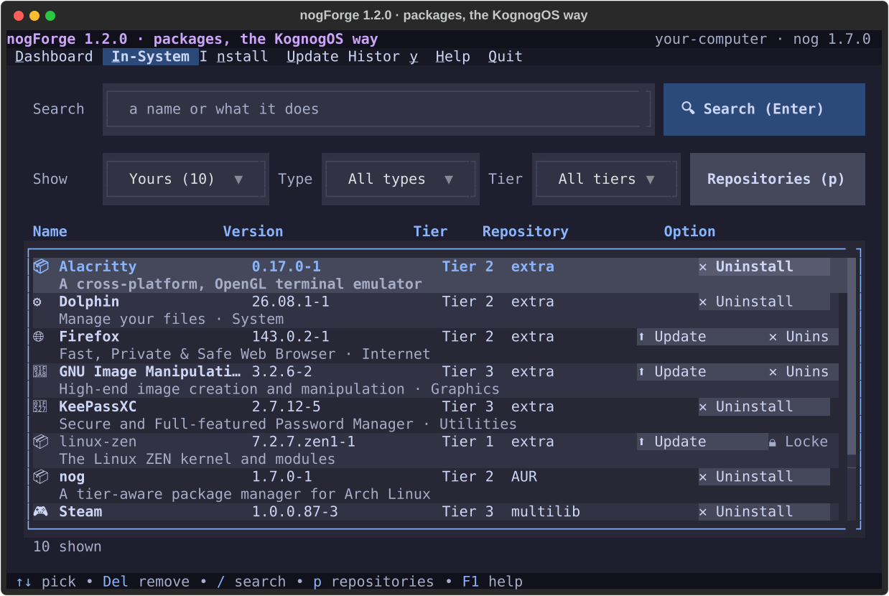
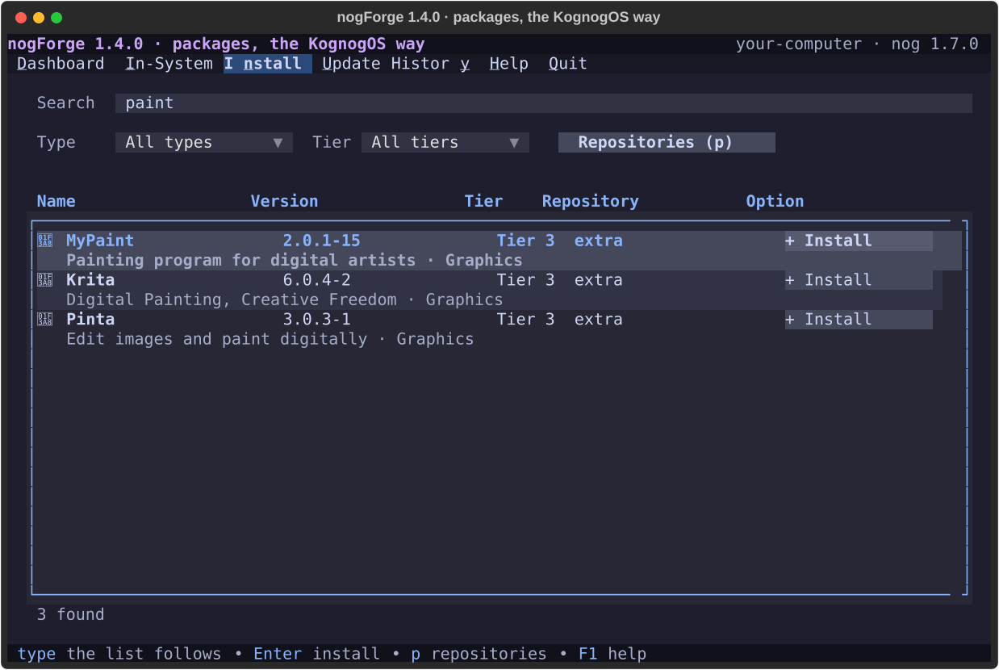
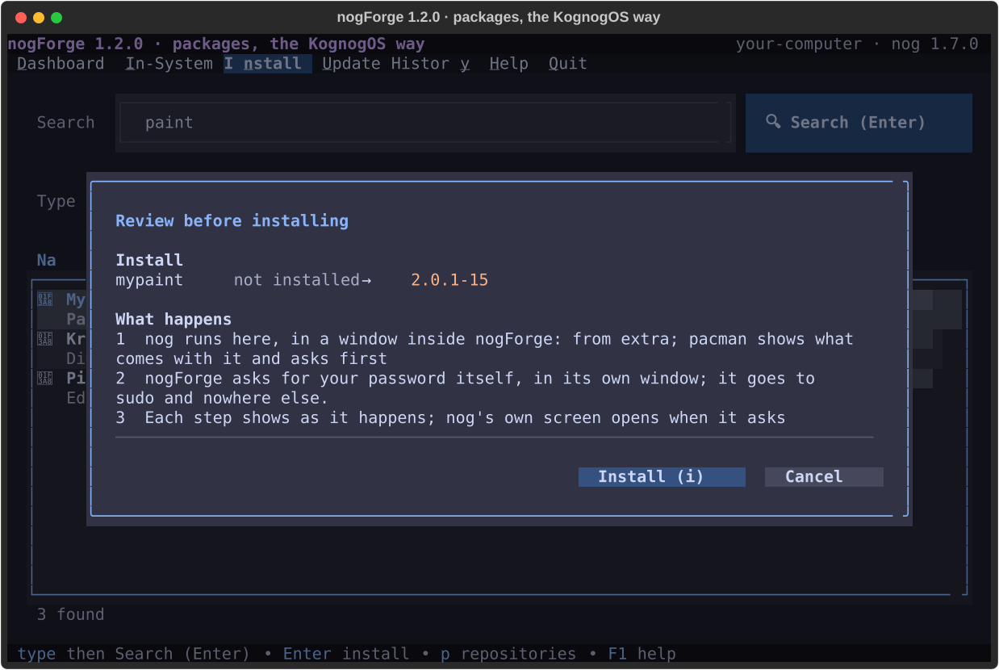
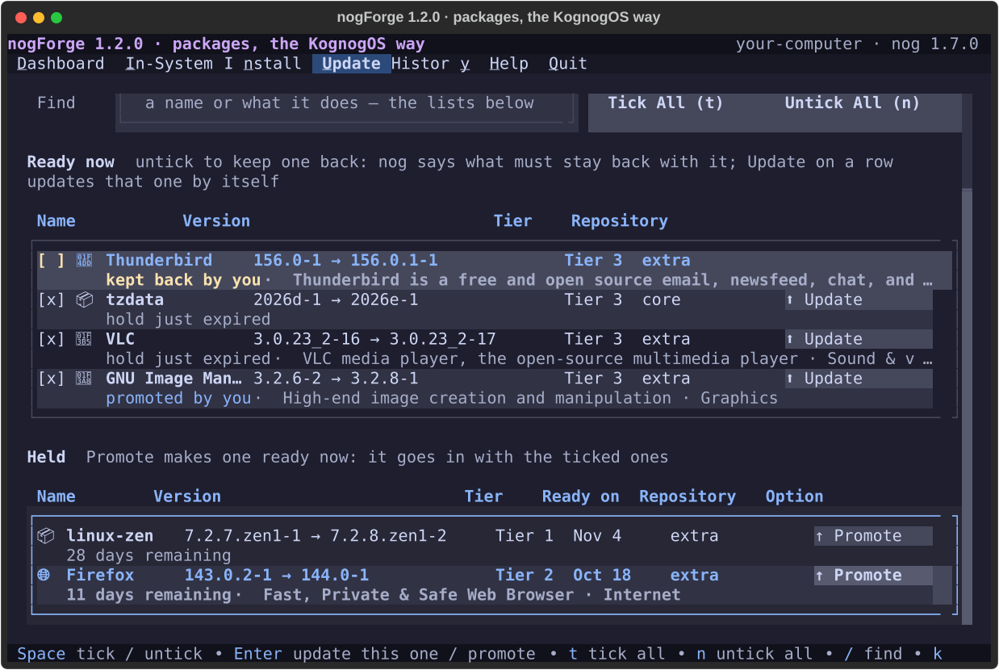
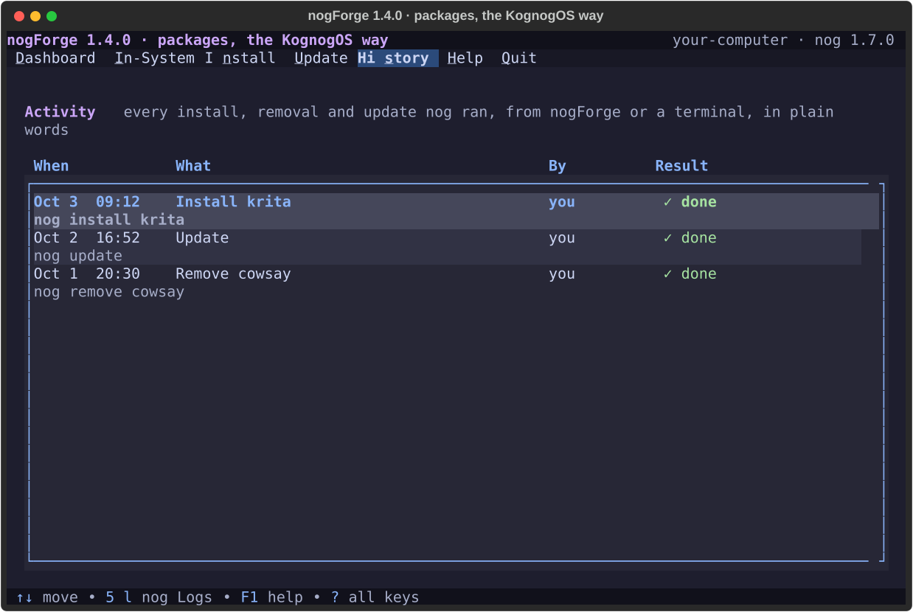
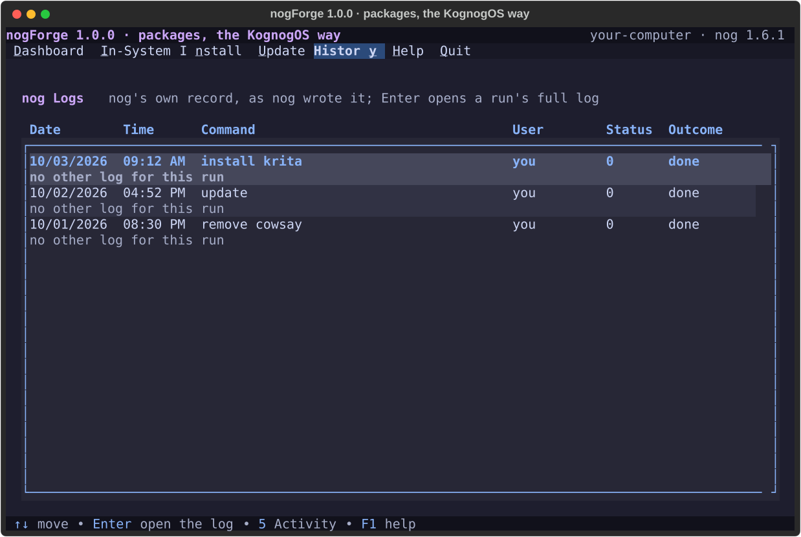

# nogForge

> Packages, the KognogOS way: what's installed, searching and installing, and updates, in plain words, in a terminal. The decisions are **nog**'s; nogForge shows them.


---

## Why nogForge?

[nog](https://github.com/jetomev/nog) is KognogOS's package manager: pacman with a safety net. Every package has a **tier**, and a new version waits before it installs (30 days for the kernel and its kind, 15 for the desktop, 7 for the rest) so it can prove itself on other people's computers first.

nogForge brings what [Pamac](https://github.com/manjaro/pamac), Manjaro's software centre, does so well (with thanks: it's the inspiration) to the terminal, on top of nog: your programs as a table, a search with types, and updates you can read. **nog decides; nogForge shows it.** Tiers, holds and which packages must move together are never worked out twice.

---

## What's in the beta

- 🏠 **Dashboard**: updates per source and tier (nog's real plan), your packages per source and tier, the last things nog did, and the space old downloads take.
- 📦 **Home**: your installed packages, spreadsheet-style: badge, name, version, tier, and **Remove** on the right, with what it is underneath. System packages are **Locked**, with the reason: the system needs it to start, it's part of the base system, or another package needs it.
- 🔎 **Search**: the repositories and the AUR, with a type (Games, Graphics, Office…) and **Install** on the right.
- ⬆ **Update**: nog's plan with your choices. Untick an update to keep it back, and **nog** says what must stay back with it (packages that only work at matching versions untick themselves, with the reason), so a half-updated, broken system can't happen. **↑ Promote** a held one. Afterwards, **What changed** compares versions before and after, and after a new kernel offers **Restart Now (r)** or **Later (l)**.
- ⏳ **Tiers**: everything nog is holding, soonest first, by tier; change a package's tier or promote it.
- 🗂 **History**: every install, removal and update nog ran, from nogForge or a terminal.
- 🔐 **Your password goes to the system's own window**, never to nogForge (like grubForge). The change itself runs in the terminal, where pacman shows what comes with it and asks first.
- 📖 A manual inside the app (**F1**), readable on a plain text console, nothing cut off at 100 columns.

Arch's app catalogue (the one Pamac uses) gives apps their proper names and a category badge (🎮 🎨 🎵 📝 🌐 ⚙); a terminal can't draw app icons, and on a text console the badges become two letters.

The design, drawn and approved before any code: [`docs/design/v0.1-screens.html`](docs/design/v0.1-screens.html).

---

## Screenshots

### Dashboard


### In-System


### Install, and the review before installing



### Update: one kept back, one promoted


### History: Activity and nog Logs



*Made from the running app (`python docs/screenshots/generate.py`) with a stand-in nog and a sample package list.*

---

## Requirements

- KognogOS or Arch Linux
- **nog 1.6.0 or newer** (nogForge reads its `--json` answers)
- Python 3.11+, `python-textual`, `python-rich`, [`python-forgekit`](https://github.com/jetomev/forgekit) 0.5.1+
- `archlinux-appstream-data` for app names and badges (optional; without it every package gets the plain badge)
- A password window for `sudo -A` (KDE's `ksshaskpass`, or `x11-ssh-askpass`); without one, nog asks in the terminal

## Running the beta

```bash
git clone https://github.com/jetomev/nogforge.git
python3 nogforge/main.py
```

nogForge isn't on the AUR yet: it stays a beta until everything in the design is there, Flatpak and Snap installs included.

---

## Keys

| Key | Does |
|---|---|
| 1 – 6 | Dashboard, Home, Search, Update, Tiers, History |
| u / r / h | review updates (on Update: update the ticked ones) / review packages (Search) / History |
| Space | tick or untick an update |
| Enter | the row's option: install, remove, promote, or change its tier |
| Del | remove the selected package (Home) |
| / | find |
| c | check for updates (Update) · clean up (Dashboard) |
| F1 | help on this screen |
| ? | all keys |
| q | quit |

---

## Roadmap (betas, each tested by Javier before the next)

- [x] **0.1** — Dashboard, Home, Search, install and remove, History
- [x] **0.2** — Update with choices: untick to keep back (nog says what must stay with it), promote a held one, "What changed", restart after a kernel update
- [x] **0.3** — Tiers: everything waiting, change a tier, promote
- [ ] **0.4** — Settings: nog's holds and sources, pacman's safe options, repositories (signatures required, key checked first), cleaning
- [ ] **Later** — Flatpak and Snap installs (with nog), then 1.0

---

## How this project is built

A human and AI collaboration: the screens were drawn and approved before any code, every change is tested (27 tests, a stand-in nog, so no test touches your packages), and the `testing/` folder holds the test matrices, published on purpose.

## Authors

**Javier ([@jetomev](https://github.com/jetomev))**: idea, direction, testing

**Claude (Anthropic)**: co-developer, architecture, implementation

## License

GPL v3. See [LICENSE](LICENSE).
